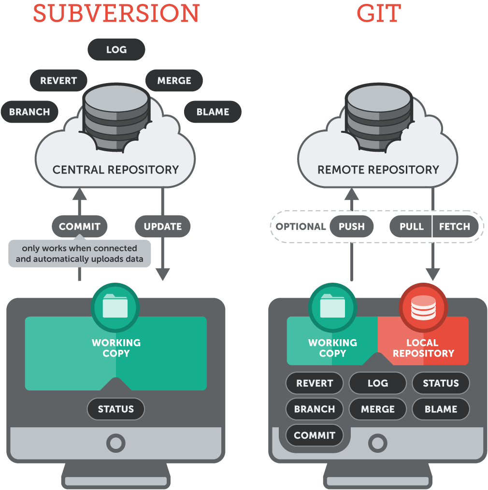
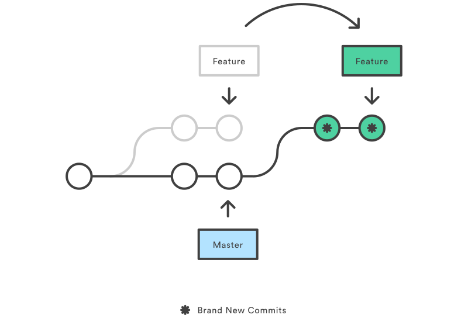

# Git R' Done
### This talk
https://codecounselors.github.io/gitrdone
### Git Repository
https://github.com/CodeCounselors/gitrdone
#### Brought to you by
<a href="http://www.codecounselor.org">Nate Good</a> / <a href="http://twitter.com/codecounselor">@codecounselor</a></small>
note:
- poll audience
- goal: learn and apply at least one new thing

SLIDE
# First Things First

  
  !==
  

note:
- Clarify the difference.  GH adds a ton of features on top of Git

VSLIDE
# Git Characteristics

note:
- distributed, remote
- Not a talk about comparing SCM systems but git was a bit of a game changer

VSLIDE
# Tools?
- Terminal ([Oh My ZSH](https://github.com/robbyrussell/oh-my-zsh/wiki/Cheatsheet#git), [Oh My Bash](https://github.com/ohmybash/oh-my-bash))
- Git Clients (SourceTree, Tower, IDEs, etc)
- OS Integrations (TortoiseGit)
- Diff Tools (IDEs, KDiff, etc)
note:
- right how, a terminal.  
- introduce new ones as we go; discuss briefly
- learn the CLI but use tools where it makes sense (merging, staging, conflict resolution)

SLIDE
# Let's Git Started

VSLIDE
# Install Git
- https://git-scm.com/download or package manager of your choice
- Basic Setup https://help.github.com/articles/set-up-git/
  - `git config --global user.name "John Doe"` <!-- .element: class="git-command" -->
  - `git config --global user.email "email@example.com"` <!-- .element: class="git-command" -->
  - `git config --global --list` <!-- .element: class="git-command" -->
- GitHub Authentication (HTTPS or SSH)
  - https://help.github.com/articles/set-up-git/#next-steps-authenticating-with-github-from-git
note:

VSLIDE
# git clone
<!-- .element: fragment="file" -->
1. cd `~/projects` <!-- .element: class="file" -->
1. [git clone git@github.com:CodeCounselors/gitrdone.git](https://github.com/CodeCounselors/gitrdone) <!-- .element: class="git-command" -->
1. cd `gitrdone` <!-- .element: class="file" -->
note:
-

VSLIDE
# Apply Modifications
1. Make a local change to `contrib/index.html` <!-- .element: class="file" -->
1. <!-- .element: class="fragment" --> `git status` <!-- .element: class="git-command" -->
1. <!-- .element: class="fragment" --> touch `new.txt` <!-- .element: class="file" -->
1. <!-- .element: class="fragment" --> `git status` <!-- .element: class="git-command" -->
  - <!-- .element: class="fragment" --> `Changes not staged for commit` <!-- .element: class="git-text" -->
  - <!-- .element: class="fragment" --> `Untracked files` <!-- .element: class="git-text" -->
1. <!-- .element: class="fragment" --> `git add contrib` <!-- .element: class="git-command" -->
1. <!-- .element: class="fragment" --> `git status` <!-- .element: class="git-command" -->
  - <!-- .element: class="fragment" --> `Changes to be committed` <!-- .element: class="git-text" -->
1. <!-- .element: class="fragment" --> `git commit -m "my first contribution"`  <!-- .element: class="git-command" -->
  - <!-- .element: class="fragment" --> `Your branch is ahead of 'origin/<branch>' by 1 commit` <!-- .element: class="git-text" -->

VSLIDE
# What Just Happened?

TODO: Make my own image reflecting this repo (hashes)

[Interactive Git Cheatsheet](https://ndpsoftware.com/git-cheatsheet.html)
note:
-workspace/index

VSLIDE
# One Last Thing

`git push`  <!-- .element: class="fragment git-command" -->

Oh no, what happened? <!-- .element: class="fragment" -->

`ERROR: Permission to <repo> denied to <user>.` <!-- .element: class="fragment git-text" -->

SLIDE
# Working with Others
1. Working with a team `clone`<!-- .element: class="fragment git-command" -->
2. Working on open source `fork`<!-- .element: class="fragment git-concept" -->
note:
- Clone a repo when you have write permission (e.g. to create branches) or only want to experiment with a read-only repo
- Fork a repo that you do not have permissions to but you want to:
  1. submit PRs
  2. fork and maintain

VSLIDE
# Your Own Branch
1. <!-- .element: class="fragment" --> `git checkout -b cposc-contrib` <!-- .element: class="git-command" -->
 - `-b` creates the branch named `cposc-contrib`
 - `checkout` switches to the new branch
note:
- Why create a branch? (vs working off master/develop)
- Mention aliases here (run `gc -b`, `gb`, etc)
- Talk about -v, --v, --remote flags for `branch`

VSLIDE
# Tidy History
### (Interactive `rebase`<!-- .element: class="git-command" -->)
#### WARNING: Rewrites history <!-- .element: class="warning" -->
1. Make a few commits
1. `Squash`<!-- .element: class="git-concept" --> them (Why?)
  - <!-- .element: class="fragment" -->Find the commit before your first change (e.g. `7d24aaf`<!-- .element: class="git-text" -->)
  - <!-- .element: class="fragment" -->`git rebase -i`<!-- .element: class="git-command" --> &nbsp;`7d24aaf`<!-- .element: class="git-text" -->
note:
- Why squash commits?
  - Keeps history clean if you are not doing a rebase when merging
  - Less steps if you have to rebase your branch from origin/upstream

VSLIDE
# Create Pull Request
1. <!-- .element: class="fragment" -->`git push`<!-- .element: class="git-command" -->
  -  <!-- .element: class="fragment" -->`git push --set-upstream origin cposc-contrib`<!-- .element: class="git-command" -->
1. <!-- .element: class="fragment" --> Create `pull request`<!-- .element: class="git-concept" --> on GitHub
  - GitHub will give your a url in the terminal
  - Or just go to GitHub and create a pull request from a branch
note:
-

VSLIDE
# Contribute to Open Source
1. <!-- .element: class="fragment" -->Fork the repo on GitHub
1. <!-- .element: class="fragment" -->`git remote rename origin upstream`<!-- .element: class="git-command" -->
1. <!-- .element: class="fragment" -->`git remote add origin git@github.com:username/gitrdone.git`<!-- .element: class="git-command" -->
1. <!-- .element: class="fragment" -->`git branch -u origin/master`<!-- .element: class="git-command" -->
  - sets `master`<!-- .element: class="git-concept" --> to track `origin`<!-- .element: class="git-concept" -->, not `upstream` <!-- .element: class="git-concept" -->
note:
- run `git remote -v` before and after steps 2-4 to see what's going on
- https://help.github.com/articles/syncing-a-fork/

VSLIDE
# Staying in Sync

Source: https://hackernoon.com/mastering-git-why-rebase-is-amazing-a954485b128a

SLIDE
# Every Day Git

### A Pro Git User is:
### <!-- .element: class="fragment blue" -->efficient
### <!-- .element: class="fragment red" -->lazy
### <!-- .element: class="fragment green" -->imperfect
### <!-- .element: class="fragment orange" -->careful
### <!-- .element: class="fragment magenta" -->aware
note:
- **efficient**: use aliases and tools to cut down on redundant tasks (e.g. pushing new branch)
- **lazy**: hooks, .gitconfig (e.g. pager), etc.
- **imperfect**: how to fix mistakes
- **careful**: read the documentation (e.g reset --hard, don't just copy/paste Stack Overflow)
- **aware**: There is a lot to Git, know what it can do for you

VSLIDE
# Commit Hooks
### `gitrdone/.git/hooks` <!-- .element: class="file" -->
1. Decorative Hooks - do something to the commit
1. Safety Hooks - prevent bad commits
1. Notification Hooks - do something after a commit

VSLIDE
# Mistakes Happen
1. Forgot a file in commit? <!-- .element: class="fragment" -->
  - `git commit --amend` <!-- .element: class="git-command" -->
1. Committed something you shouldn't have? <!-- .element: class="fragment" -->
  - `git reset --soft HEAD~` <!-- .element: class="git-command" -->
1. Something broke but you have no idea when or where? <!-- .element: class="fragment" -->
  - `git bisect` <!-- .element: class="git-command" -->
1. Accidentally wiped out changes you now need? <!-- .element: class="fragment" -->
  - `git reflog` <!-- .element: class="git-command" -->
    - (If you committed them, otherwise use a good IDE)
note:
- if something was staged, just use a GUI to unstage files or hunks (demo SourceTree)

VSLIDE
# Amend a Commit
#### WARNING: Rewrites history <!-- .element: class="warning" -->
#### `git commit --amend` <!-- .element: class="git-command" -->
1. Changing a commit message at `HEAD`<!-- .element: class="git-concept" -->
2. Adding more changes to the previous commit
----
#### `git rebase --interactive` <!-- .element: class="git-command" -->
1. Amending a commit farther back in the history
2. combining, reordering, or deleting commits

VSLIDE
# Undo ... Undo!
#### `git reset --soft HEAD~` <!-- .element: class="git-command" -->
note:
- "git undo" use case: stash on the branch instead of stash

VSLIDE
# Who's Fault?
`git blame` <!-- .element: class="git-command" --> (annotate)

(But if that doesn't help, `bisect`<!-- .element: class="git-command" --> to the rescue!)

VSLIDE
# git-bisect
####  `binary search to find the commit that introduced a bug`

1. <!-- .element: class="fragment" -->Find a commit that works as expected (e.g. `381147c`<!-- .element: class="git-text" -->)
1. <!-- .element: class="fragment" -->`git bisect start`<!-- .element: class="git-command" -->
1. <!-- .element: class="fragment" -->`git bisect bad`<!-- .element: class="git-command" --> (assuming the `HEAD`<!-- .element: class="git-text" --> is bad)
1. <!-- .element: class="fragment" -->`git bisect good`<!-- .element: class="git-command" --> &nbsp;`381147c`<!-- .element: class="git-text" -->
1. for each revision, execute one of: <!-- .element: class="fragment" -->
  - `git bisect good`<!-- .element: class="git-command" -->
  - `git bisect bad`<!-- .element: class="git-command" -->
1. <!-- .element: class="fragment" -->`git bisect reset`<!-- .element: class="git-command" -->

<!-- .element: class="fragment" -->Tip: You can provide a command to automate the good/bad check

SLIDE
# Questions?
------------
### Resources
1. [Git - the simple guide](http://rogerdudler.github.io/git-guide/)
1. [Git Cheatsheet](http://ndpsoftware.com/git-cheatsheet.html)
1. [Oh Shit Git](https://ohshitgit.com/)
1. [Git Book (Official Docs)](https://book.git-scm.com/)
1. [Pro Git (the book)](https://git-scm.com/book/en/v2)

VSLIDE
# Thank You

SLIDE
#### Legend
- `git commands` <!-- .element: class="git-command" -->
- `git concepts` <!-- .element: class="git-concept" -->
- `git text` <!-- .element: class="git-text" -->

VSLIDE
# Didn't make the cut
- `grep (log -S)`
- `--force-with-lease`

VSLIDE
# Things learned
While preparing this talk I learned:
1. `core.sshCommand` to specify ssh key (`GIT_SSH_COMMAND`)
